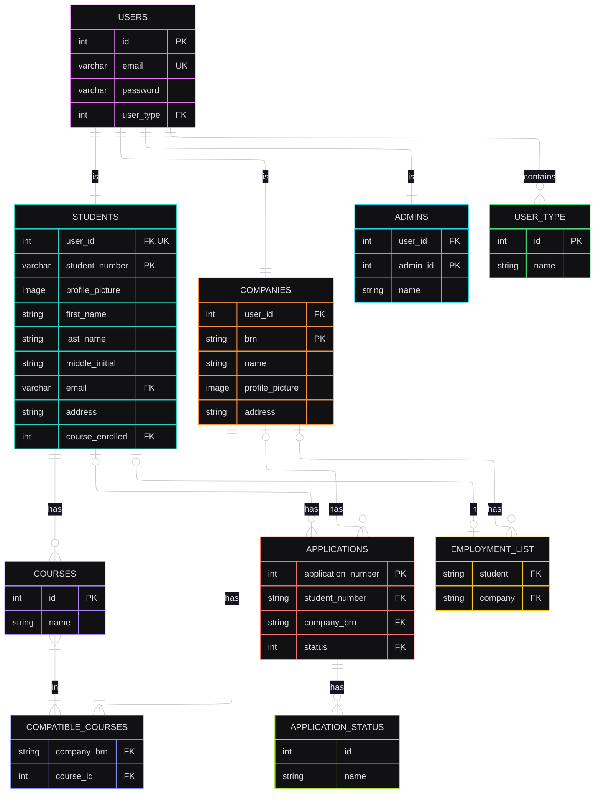

```mermaid
---
config:
  theme: redux-dark-color
  layout: elk
---
erDiagram
    USERS ||--|| STUDENTS : is
    USERS ||--|| COMPANIES : is
    USERS ||--|| ADMINS : is
    USERS ||--o{ USER_TYPE : contains
    STUDENTS ||--o{ COURSES : has
    STUDENTS |o--o{ APPLICATIONS : has
    STUDENTS |o--o| EMPLOYMENT_LIST : in
    COURSES }|--|{ COMPATIBLE_COURSES : in
    COMPANIES ||--|{ COMPATIBLE_COURSES : has
    COMPANIES |o--o{ APPLICATIONS : has
    COMPANIES |o--o{ EMPLOYMENT_LIST : has
    APPLICATIONS ||--o{ APPLICATION_STATUS : has
    USERS {
        int id PK
        varchar email UK
        varchar password
        int user_type FK
    }
    USER_TYPE {
        int id PK
        string name
    }
    COURSES {
        int id PK
        string name
    }
    STUDENTS {
        int user_id FK, UK
        varchar student_number PK
        image profile_picture
        string first_name
        string last_name
        string middle_initial
        varchar email FK
        string address
        int course_enrolled FK
    }
    COMPANIES {
        int user_id FK
        string brn PK
        string name
        image profile_picture
        string address
    }
    ADMINS {
        int user_id FK
        int admin_id PK
        string name
    }
    COMPATIBLE_COURSES {
        string company_brn FK
        int course_id FK
    }
    APPLICATIONS {
        int application_number PK
        string student_number FK
        string company_brn FK
        int status FK
    }
    APPLICATION_STATUS {
        int id
        string name
    }
    EMPLOYMENT_LIST {
        string student FK
        string company FK
    }

```